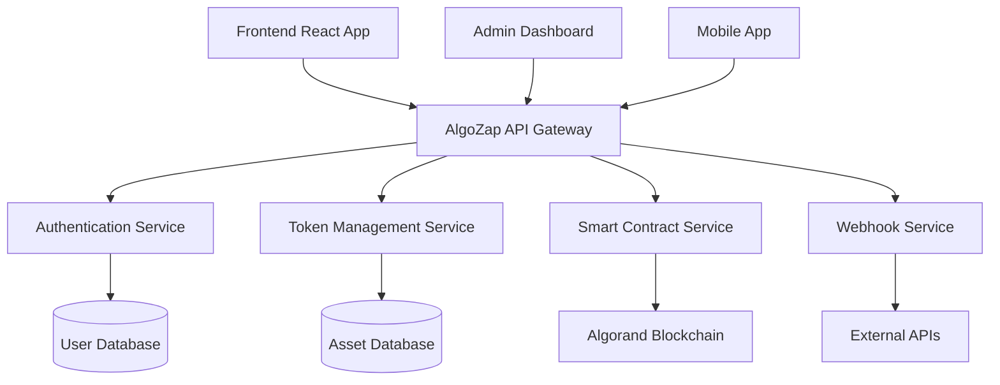

# 🚀 AlgoZap - Web3 Automation Platform

<div align="center">

**Seamless Web3 Integration & Automation Platform**

[](https://github.com/algozap/algozap)
[](https://github.com/algozap/algozap)
[](https://nodejs.org)
[](https://mongodb.com)


---

</div>

## 🌟 Overview

AlgoZap revolutionizes Web3 application development by providing a comprehensive automation platform that bridges traditional web applications with blockchain technology. Built on the Algorand ecosystem, it offers developers the tools to create sophisticated decentralized applications with minimal complexity.

### 🎯 Why AlgoZap?

- **🔐 Universal Authentication**: Support for email, wallet, and username authentication
- **⚡ Event-Driven Architecture**: Real-time webhook integration for seamless automation
- **🔗 Cross-Platform Integration**: Connect any application to the Algorand blockchain
- **🛡️ Enterprise Security**: Multi-layer security with wallet binding and secure token management

---

## 🌟 Features

### Core Functionality

| Feature | Description | Status |
|---------|-------------|--------|
| 🔑 **Multi-Auth System** | Email, Wallet & Username authentication | ✅ Production Ready |
| 🔗 **Wallet Binding** | Secure wallet-to-application association | ✅ Production Ready |
| 🎣 **Webhook Engine** | Real-time event processing and automation | ✅ Production Ready |
| 🔒 **Security Suite** | Advanced encryption and access control | ✅ Production Ready |

### Blockchain Integration

- **Token Management**: Create, manage, and transfer Algorand Standard Assets (ASA)
- **Smart Contracts**: Deploy and interact with Algorand smart contracts
- **Transaction Processing**: Handle complex multi-signature transactions
- **Asset Controls**: Advanced metadata and permission management

---

## 📦 Installation

### Prerequisites

Ensure you have the following installed:

- **Node.js** (v18 or higher)
- **MongoDB** (v6 or higher)
- **Git**
- **Algorand SDK**

### Quick Start

```bash
# Clone the repository
git clone https://github.com/algozap/algozap.git
cd algozap

# Install dependencies
npm install

# Set up environment variables
cp .env.example .env
# Edit .env with your configuration

# Start MongoDB (if not running)
mongod --dbpath /path/to/your/db

# Run database migrations
npm run db:migrate

# Start the development server
npm run dev
```

---

## 🔐 Authentication

AlgoZap supports multiple authentication methods to suit different use cases:

### 1. Email Authentication

### 2. Wallet Authentication

---

### 📚 Progressive Tasks

#### 2. 🔧 **Intermediate: Add Metadata and Asset Controls**
Enhance your tokens with rich metadata and advanced controls.

**What you'll learn:**
- Asset metadata standards
- Freeze/clawback mechanisms
- Asset management best practices
  
---

#### 3. ⚡ **Advanced: Smart Contract Tokenization**
Build tokens with programmable logic using PyTeal.

**What you'll learn:**
- Smart contract development
- Conditional transfers
- Automated token distribution

---

#### 5. 🌐 **Integration: Application Integration**
Connect your tokens to real-world applications.

**What you'll learn:**
- API integration patterns
- Webhook implementation
- User experience design

---

**Architecture Overview:**


---

## 🛠️ Development

### Development Setup

```bash
# Install development dependencies
npm install --include=dev

# Run tests
npm test

# Run tests with coverage
npm run test:coverage

# Start development server with hot reload
npm run dev

# Lint code
npm run lint

# Format code
npm run format
```

### Testing

We use Jest for unit testing and Supertest for API testing:

```bash
# Run all tests
npm test

# Run specific test suite
npm test -- --grep "Authentication"

# Run tests in watch mode
npm run test:watch
```

### Building for Production

```bash
# Build the application
npm run build

# Start production server
npm start
```

---
**Made with ❤️ by Nearcult**
